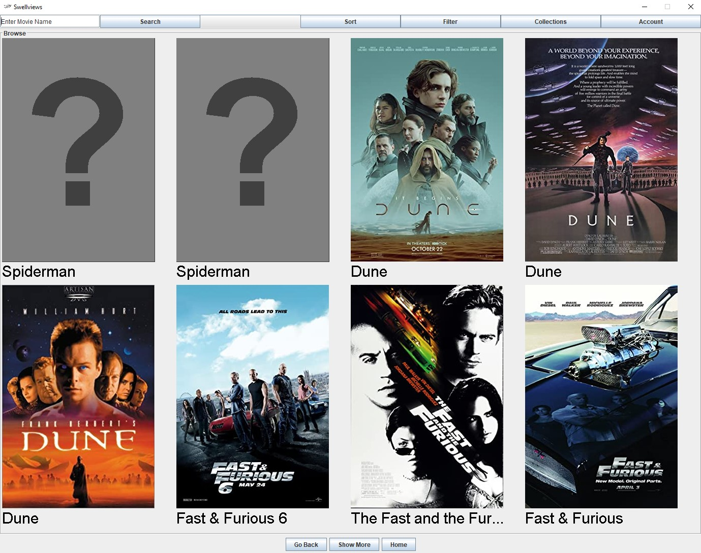
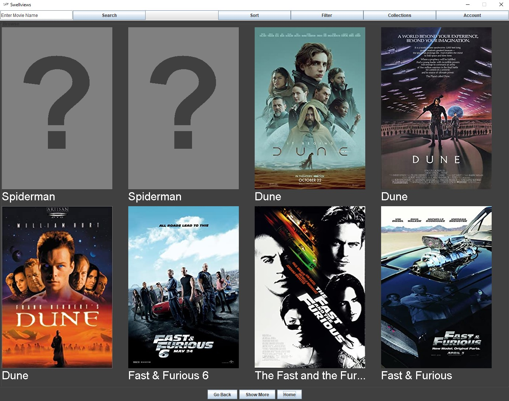
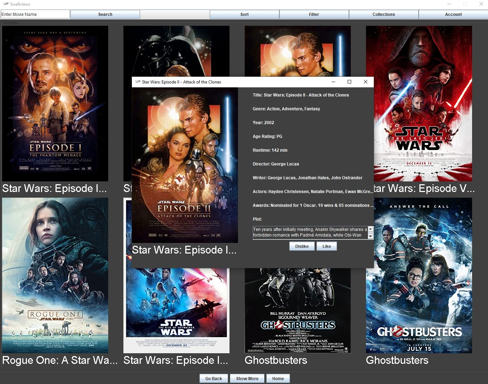
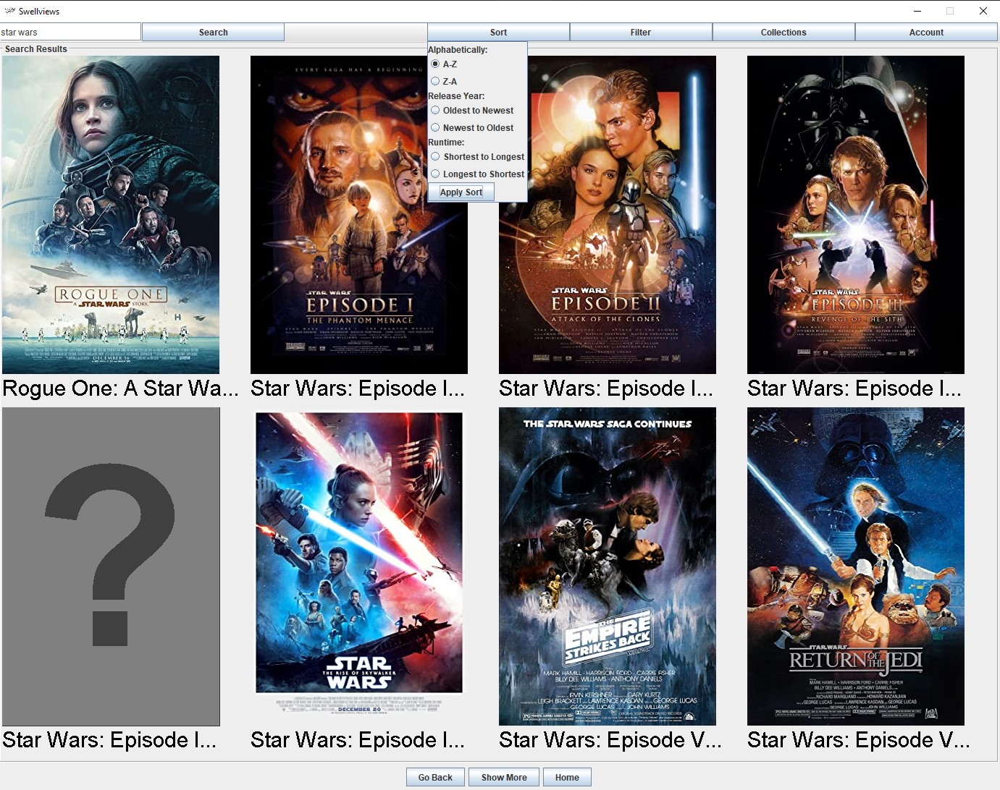
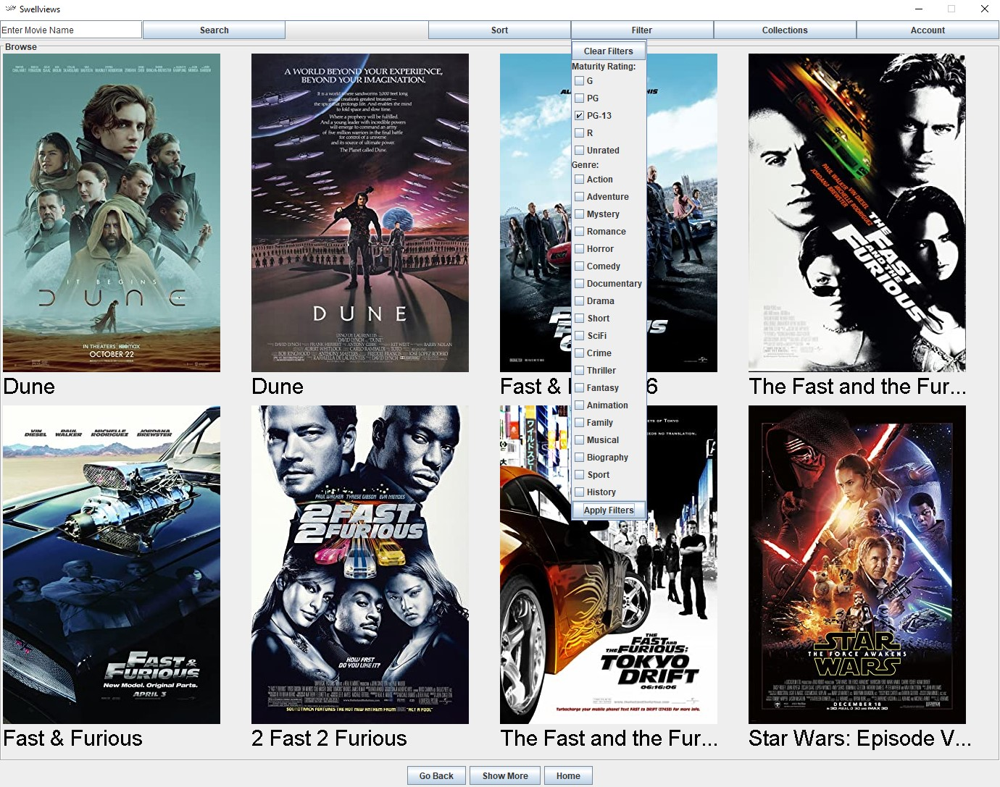
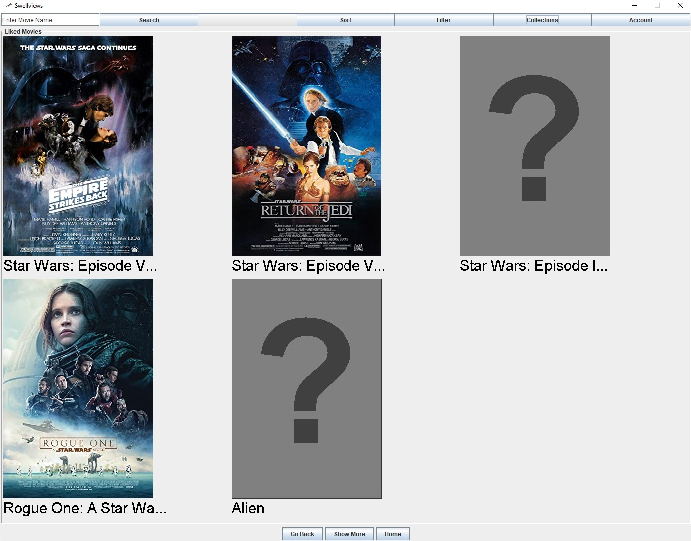
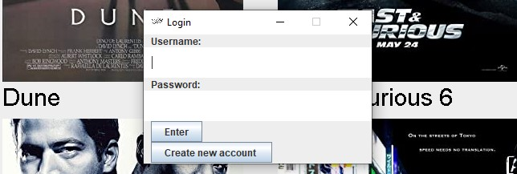

# George's Version Improvements:
**-Added permanent accounts (saved in JSON format) with private collections of liked and disliked movies (also in JSON).**

**-Added the ability to create new accounts.**

-Added a new logo/icon for headers and the taskbar.

-Added a way to check if a movie has already been added to a collection, preventing duplicate movie objects.

-Added a pop-up to notify the user of a failed log-in attempt.

-Added scrolling ot moviePlot JTextAreas within the details JFrame.

-Changed the search feature to be case IN-sensitive.

-Separated the MovieDetailsDisplay into its own class to reduce the size of Home.java by a little over 10%.

-Various resizing tweas including a minimum size for the details JFrame and making the main page non-resizable.

-Fixed an issue wehre outdated image URLs would cause certain pages to not load. Now displays the default "missing" poster image instead for the affected movies.

-Fixed an incorrect URL for "The Fast and the Furious: Tokyo Drift."

-Fixed a bug where the "Show More" button for Liked and Disliked collections with more than 8 items would revert movieGrid back to the default "Browse" mode.

-Fixed a bug where the "Log-Out" would not appear after the user has already logged out once and re-logged in.

-Various other tweaks and improvements.

# Swellviews - George's Version:

This is a completed version of a group project for CS321 which was not completed for reasons **mostly** outside of my own control. 

However, even though the class is over, I thought it would be worthwhile to finish the project not only to have a decently large and complex project in my repositories, but also so that I could get a more complete understanding of all the different parts of the application creation process.

When we first created this project, my main responsibility was to design and create the GUI. I felt I did a pretty good job considering it was my first time working with graphical elements, but refining was, and still is to a lesser degree, needed. 
Other areas also had room for improvement; like the search feature, for example, which was inconveniently case sensitive. 

But the biggest change was the account/user system. The goal was to have a way for users to create accounts with a username and password that they would use to store "collections" of movies. 
The majority of the collection system was completed, but very little of the account system was ever created. 
So, I took it upon myself to complete this functionality along with the smaller improvements/finalizations to other areas. 

# What It Is:

Swellviews is a simple java application meant to act similarly to the basic functionalities of goodreads.com (do you get the name now?) except with a focus on movies rather than books.

Users can browse, sort, filter, and search through a collection of movies (stored in a local JSON file), viewing details such as their runtime, age rating, IMDB rating, etc. They can also add movies to collections, including simply "liked" and "disliked" movies, both of which are tied to their accounts created with the traditional username and password system (and stored locally in JSON format). 

There's also a dark mode! 

# How To Use It:

**Browsing:** Displayed on startup. Use the "Show More" button on the bottom to move to the next page. Use "Go Back" to go back a page. Eight movies can be displayed on a page at once. Press "Home" on the bottom of the screen at any time to return to the beginning of the Browse section. 

**Searching:** Type your search query into the search bar in the top left of the screen and press the enter button next to it. All movies containing your search word(s) will be displayed. Searching is case insensitive. 

**Sorting:** Sort the Browse section or any search/filter results by clicking on the "Sort" button in the top middle of the screen. Select any ONE search criteria from the dropdown menu and click the "Apply Sort" button at the bottom of the dropdown.

**Filtering:** Click the "Filter" button at the top of the screen and select and ONE filter criteria from the dropdown menu. Click the "Apply FIlter" button at the bottom of the dropdown.

**Log-In:** Click the "Account" button in the top right corner of the screen and select "Log-In/Create an Account." A popup menu will appear. Type your username and password into their respective fields and press the "Enter Button" below them. A new popup will appear notifying the user if the log-in attempt has failed, otherwise the log-in was successful. **NOTE: The user must be logged out to be able to log-in to an account. Users are logged out by default on opening the application.**

**Log-Out:** Click the "Account" button in the top right corner of the screen and select "Log-Out." This will log out any active user and remove their Liked and Disliked collections from being viewable. **NOTE: The user must be logged in to be able to log-out of their account.**

**Create an Account:** Click the "Account" button in the top right corner of the screen and select "Log-In/Create an Account." A popup menu will appear. Click the button labeled "Create New Account." The popup menu will close and a new one will appear. Type your desired username and password into their respective fields and click on the "Create Account" button. The popup will close and you will now be able to log-in using the username and password you just created. 

**Toggle Dark Mode:** Click the "Account" button in the top right corner of the screen and select "Toggle Dark Mode." Then click any of the three page-navigaion buttons ("Go Back," "Show More," or "Home") on the bottom of the screen. The background color of the app will change from white to dark grey or from dark grey to white. Text will also change from black to white or white to black. 

**View Movie Details:** Click on a movie image or title to open a popup menu for that specific movie. On the left side will be the movie poster and title. On the right side will be more details including genre, runtime, age rating, plot, and more. There will also be two buttons labelled "Like" and "Dislike" which are used to add movies to collections. 

**Add a Movie to a Collection:** Open the details popup for the movie you want to add (see above) and locate the "Like" and "Dislike" buttons. Select either button to add it to that collection. If the user is not logged in, these collections will be lost when the application is closed. If the user is logged in, the movies will be saved, and the user will be able to see their liked and disliked movies after closing and reopening the program by logging back into thier account. 

**View Movie Collections:** Click the "Collections" button at the top of the screen and select whether you'd like to view "Liked" or "Disliked" movies. All movies added to the chosen collection will be displayed. The user can still use the "Show More" and "Go Back" buttons on the bottom of the screen if they have more than eight movies in a collection. **NOTE: If the user is not logged into their account, they will not be able to see any of their liked or disliked movies from the last time they were logged in.**

Screenshots:

